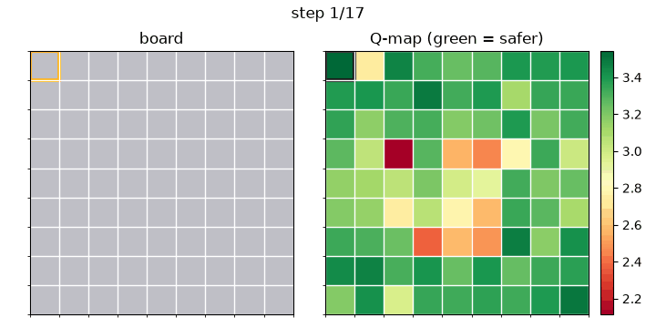
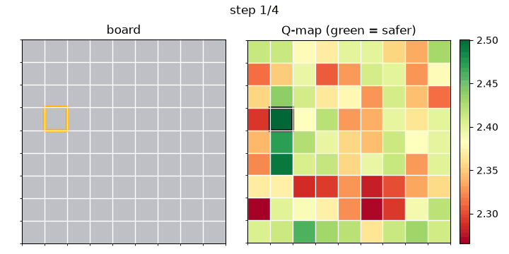
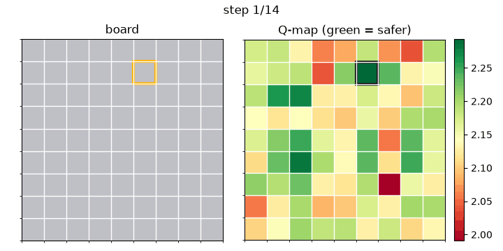
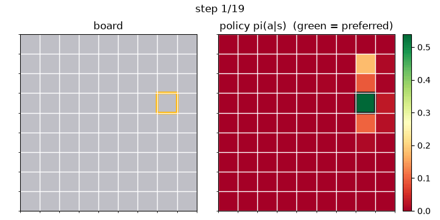
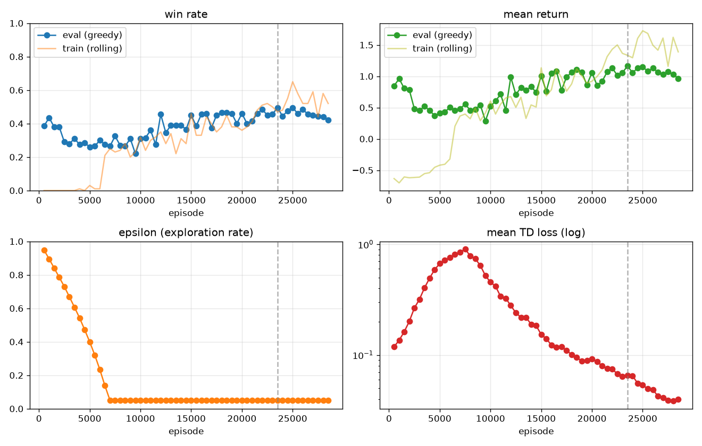
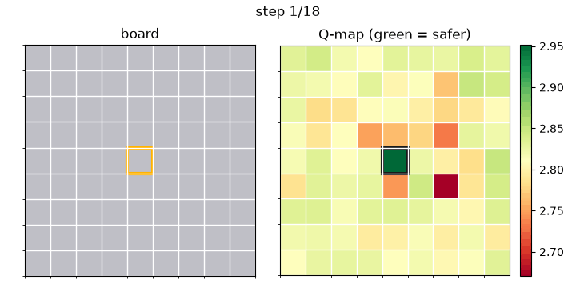

# Reinforcement Learning Agent to Solve Minesweeper Boards with Transfer Learning

This repository trains agents to play Minesweeper and visualizes their gameplay.
It compares a value-based approach (**Double DQN**, in three variants) against a
policy-gradient approach (**PPO**), all on a 9×9 board with 10 mines.

**Headline result:** the DQN variants plateau around a **0.32–0.42** greedy win
rate; PPO reaches **~0.87**, close to the practical ceiling for pure RL on this
board (~0.90). A transfer-learning experiment — learning from human
demonstrations — lifts the best value-based agent from **0.42 to ~0.50** with a
carefully tuned imitation loss, but does not close the gap to PPO.

---

## Contents

- [Game Environment](#game-environment)
- [MDP Formulation](#mdp-formulation)
  - [Action Space](#action-space)
  - [Observation Space](#observation-space)
  - [Reward Function](#reward-function)
- [DDQN](#ddqn)
  - [The three modes](#the-three-modes)
- [PPO](#ppo)
- [Theory](#theory)
- [Usage](#usage)
- [Results](#results)
  - [Metrics](#metrics)
  - [Training results](#training-results)
  - [Evaluation results](#evaluation-results)
  - [Gameplay](#gameplay)
  - [Discussion](#discussion)
- [Transfer Learning](#transfer-learning)
  - [Motivation](#motivation)
  - [Method](#method)
  - [Results](#results-1)
  - [Discussion](#discussion-1)

---

## Game Environment

- **`minesweeper_env.py`** defines the game logic — board generation, mine
  placement, reveal + flood-fill cascade, and win/loss detection — wrapped in a
  Gymnasium `Env` that returns the observation, reward, termination flags, and a
  legal-action mask at each step. Mines are placed lazily on the first click,
  excluding the clicked cell *and its 8 neighbours*, so the first reveal always
  opens a region (standard modern-Minesweeper behaviour). Flagging is not
  modelled: flags never change the outcome, so the agent only ever reveals.

- **`test_minesweeper.py`** runs correctness tests over the environment
  (first-click-safe, flood fill, adjacency counts, win/loss, Gymnasium API
  compliance). A debug tool, not part of training.

- **`play.py`** lets a human play Minesweeper in the terminal, against the same
  environment the agents train on.

---

## MDP Formulation

### Action Space

`Discrete(H·W)` — one action per cell (81 actions on a 9×9 board). Action `a`
reveals the cell at `row = a // W`, `col = a % W`. Only unrevealed cells are
legal; the environment supplies a boolean legal-action mask in
`info["action_mask"]`, and every agent masks illegal cells before selecting an
action (set to `-∞` before an argmax or a softmax).

### Observation Space

`Box(0, 1, shape=(11, H, W), float32)` — an 11-channel spatial tensor:

| Channel | Meaning |
|---|---|
| 0 | **Hidden mask** — 1 where a cell is unrevealed |
| 1–9 | **Count one-hot** — channel `1+k` is 1 where a revealed cell shows adjacent-mine count `k` (0–8) |
| 10 | **Mine density** — a broadcast scalar `mines_remaining / hidden_cells`, the prior probability that an unknown cell is a mine |

Channels 0–9 form a clean one-hot per cell (exactly one is 1). The legal-action
mask equals channel 0 (a cell is clickable iff it is hidden), so it is *not*
duplicated as a channel — it is passed in `info` for the agent to apply. The
fully-convolutional networks make this encoding board-size-agnostic.

### Reward Function

Dense, per click:

| Event | Reward |
|---|---|
| Safe reveal (non-terminal) | **+0.1** |
| Winning click (all safe cells revealed) | **+1.0** |
| Hitting a mine (terminal) | **−1.0** |
| Illegal click (masked out in practice) | **−1.0** |

"Per click" means a click is rewarded the same whether it cascades 1 cell or 40
— the agent is rewarded for *surviving*, not for cascade luck. An episode ends on
a mine (loss) or when every non-mine cell is revealed (win).

---

## DDQN

Double Deep Q-Network is an **off-policy, value-based** algorithm. It learns a
Q-function `Q(s, a)` — the expected return of clicking cell `a` in state `s` —
and acts greedily by taking the highest-Q legal cell. Transitions are stored in a
replay buffer and reused; a slowly-updated **target network** stabilizes the
bootstrap; and the **double** trick decouples action *selection* from *evaluation*
to curb the overestimation bias of the plain-DQN max (see [Theory](#theory)).

### The three modes

Selected with `--mode`. The modes are **cumulative**, matching the project's
development order:

- **`base`** — standard Double DQN with a fully-convolutional Q-network
  (`(B, 11, H, W) → (B, H·W)`, one Q-value per cell, no dense layers).
- **`dueling`** — adds a **dueling head** that factors
  `Q(s, a) = V(s) + A(s, a) − meanₐ A(s, a)`, separating *how good the position
  is* (`V`) from *how much better each cell is than average* (`A`). This is meant
  to sharpen the *relative ranking* of similar-valued cells in the midgame.
- **`per`** — adds **Prioritized Experience Replay** on top of dueling. Instead
  of sampling the buffer uniformly, it samples transitions with probability
  `∝ |TD-error|^α`, so rare, high-error transitions (mine hits, misvalued cells)
  are replayed far more often; importance-sampling weights correct the bias this
  introduces.

### Files

- **`DDQN.py`** defines the Q-network (fully-convolutional: input
  `(B, 11, H, W)` → output `(B, H·W)`, no dense layer, so parameter count is
  independent of board size and weights transfer across a curriculum, 6×6 → 9×9),
  the dueling head, the uniform and prioritized replay buffers, and the agent
  (masked ε-greedy action selection, the Double-DQN update, target syncing, and
  checkpoint save/load).
- **`DDQN_train.py`** holds the training loop: it runs episodes, stores
  transitions, learns each step (ε decays as the agent acts), evaluates greedily
  on a fixed set of seeds, early-stops on a patience criterion, and writes
  training plots plus `best` and `last` checkpoints.

### Usage

```bash
python DDQN_train.py --mode base
python DDQN_train.py --mode dueling
python DDQN_train.py --mode per
```

Each writes `policies/best_<mode>.pt` (+ `_last.pt`) and
`training_plots/training_<mode>.png`. 

---

## PPO

Proximal Policy Optimization is an **on-policy, actor-critic** algorithm. A shared
convolutional body feeds two heads: an **actor** (per-cell logits → a probability
distribution over which cell to click) and a **critic** (a scalar value `V(s)`).
It collects fresh experience from **many parallel environments**, computes
advantages with **GAE**, and updates the policy with a **clipped surrogate
objective** that limits how far the policy can move per update (see
[Theory](#theory)). Because it optimizes the policy directly rather than taking an
argmax over value estimates, it avoids the failure mode where a value network
misranks a risky cell above an obviously safe one.

### Files

- **`PPO_agent.py`** defines the masked categorical policy, the actor-critic
  network, the vectorized environment, rollout collection, GAE, the clipped PPO
  update, and the training loop. Saves the best checkpoint and training plots.

### Usage

```bash
python PPO_agent.py
```

The training loop runs for a fixed iteration budget (no early stopping) and keeps
the best-return checkpoint; read the training plot to judge convergence.

---

## Theory

**Double DQN target.** The online network `θ` *selects* the next action; the
frozen target network `θ⁻` *evaluates* it, which removes the max-operator's
upward bias:

```
a* = argmax_{a' ∈ legal(s')} Q(s', a'; θ)
y  = r + γ (1 − done) · Q(s', a*; θ⁻)
L  = Huber( Q(s, a; θ),  y )
```

The `(1 − done)` term zeroes the bootstrap at terminal steps — important here,
where every mine hit and every win ends an episode.

**Dueling head.** `Q(s, a) = V(s) + A(s, a) − meanₐ A(s, a)`. Factoring the large
shared "position value" into `V` lets the advantage stream spend capacity on
ranking cells against each other. The mean-subtraction keeps the decomposition
identifiable.

**Prioritized replay.** Sample transition `i` with probability
`P(i) ∝ pᵢ^α`, where `pᵢ = |TD-errorᵢ| + ε`. Correct the resulting bias with
importance-sampling weights `wᵢ = (N · P(i))^{−β}`, with `β` annealed toward 1. A
sum-tree gives O(log N) sampling and priority updates.

**PPO — GAE and the clipped objective.** After a rollout, advantages are an
exponentially-weighted sum of TD residuals `δ_t = r_t + γ(1−d_t)V(s_{t+1}) − V(s_t)`:

```
A_t = δ_t + γλ(1 − d_t) A_{t+1}      (computed backward; (1−d) cuts game seams)
```

The policy is updated for a few epochs over the fresh batch with the clipped
surrogate, where `r_t(θ) = π_θ(a_t|s_t) / π_{θ_old}(a_t|s_t)`:

```
L_clip = −E[ min( r_t · A_t,  clip(r_t, 1−ε, 1+ε) · A_t ) ]
L      = L_clip + c₁ · (V − Rₜ)²  −  c₂ · entropy
```

The clip is what lets PPO safely take several gradient steps on one on-policy
batch: it caps how far the policy may drift from the one that generated the data.
The entropy bonus keeps exploration alive; annealing its coefficient toward 0 late
in training lets the policy fully commit to safe cells.

---

## Results

All training and evaluation was done on a **9×9 grid with 10 mines**. Evaluation
uses a **fixed set of held-out seeds** (`1_000_000 + i`), identical for the DQN and
PPO agents, so all win rates below are directly comparable.

### Metrics

- **Win rate** — fraction of games won (all non-mine cells revealed). The primary
  metric.
- **Return** — mean total reward per game. Since safe clicks pay +0.1, wins +1,
  and mines −1, higher return means more safe cells revealed and/or more wins.
  Smoother and less noisy than win rate.
- **Len** — mean number of clicks per game. A click can cascade many cells, so
  longer generally means the agent survived (revealed) longer.
- **Entropy** (PPO only) — mean entropy of the policy's action distribution; high
  early (exploring), decaying as the policy commits.
- **Ploss** (PPO only) — the clipped policy loss. It hovers near zero *by design*
  (clipped objective) and is not a progress signal — read win rate/return instead.

### Training results

| Model | Checkpoint | Training | Win rate | Return | Len |
|---|---|---|---|---|---|
| base | `best_base.pt` | 16,000 ep | 0.350 | +0.92 | 13.2 |
| dueling | `best_dueling.pt` | 22,000 ep | 0.335 | +0.82 | 12.5 |
| per | `best_per.pt` | 16,500 ep | 0.375 | +0.82 | 11.7 |
| ppo | `best_ppo.pt` | 3,250 iters | 0.850 | +2.73 | — |

*(PPO also reported entropy 0.48 and policy loss +0.038 at its best checkpoint.
Note DQN "training" is counted in episodes and PPO in iterations — they are not
directly comparable units.)*

### Evaluation results

Greedy play (argmax) over 100 held-out games:

| Model | Greedy win rate | Avg clicks |
|---|---|---|
| base | 0.42 | 12.7 |
| dueling | 0.32 | 13.6 |
| per | 0.39 | 10.9 |
| **ppo** | **0.87** | 20.6 |

### Gameplay

Generated with `visualize.py` (board on the left, the agent's decision heatmap on
the right — Q-values for DQN, policy probabilities for PPO):

| base | dueling |
|---|---|
|  |  |

| per | ppo |
|---|---|
|  |  |

**`visualize.py`** runs a policy over 100 games to measure win rate and renders a
full game as a GIF + filmstrip:

```bash
python visualize.py --mode base
python visualize.py --mode dueling
python visualize.py --mode per
python visualize.py --mode ppo
```

Each loads `policies/best_<mode>.pt` and writes
`visualization/game_<mode>.gif` and `..._filmstrip.png`.

### Discussion

- **PPO roughly doubles the value-based agents** (0.87 vs 0.32–0.42 greedy). The
  DQN variants tend to misrank cells — assigning high value to an uncertain cell
  over an obviously safe one — a known weakness of taking an argmax over a
  bootstrapped value surface. PPO optimizes the action *probabilities* directly
  and sidesteps this.
- **Dueling and PER did not clearly beat base** on this board — `base` even edges
  `dueling` at evaluation. That is a legitimate finding: their benefit is
  problem-dependent, and 9×9/10 apparently isn't complex enough (or the runs not
  long enough) for the value-ranking machinery to pay off. It is a useful reminder
  that a fancier component is not monotonically better.
- **Caveat: single seed.** These are single-run numbers, and RL is high-variance
  run-to-run. Small gaps (e.g. base 0.42 vs per 0.39) should not be over-read;
  multi-seed runs with reported spread would be needed to make firm ordering
  claims among the DQN variants. The PPO vs DQN gap is large enough to be robust.
- **Ceiling.** ~0.90 is roughly the practical maximum for pure RL on beginner
  boards, since some positions force a genuine guess no agent can win. PPO at 0.87
  is near that ceiling; closing the last gap would require a hybrid (a constraint
  solver for deducible cells + RL for the true guesses).
 
---
## Transfer Learning

Learning from human demonstrations — can a *human teacher* lift the weak
value-based agent?

### Motivation

The DQN variants plateau around **0.42** greedy win rate, and inspection shows
they lose by *misranking* — clicking an uncertain cell over an obviously safe
one. A human, by contrast, clears the large majority of boards. In the data
collected for this experiment a human won **84%** of games (see below) — far
above the 0.42 agent — which is exactly the condition under which learning from
demonstrations can help: the teacher is much stronger than the student.

The question this section answers is therefore: *do human demonstrations lift a
weak value-based agent, and under what conditions?*

### Method

**Recording.** `play.py --record` saves each played game as
`demos/game_XXXXX.npz`, storing the same transition tuple the replay buffer uses
`(obs, act, rew, next_obs, done, next_mask)` plus a `won` flag. Games are written
atomically per game, so recording can be stopped and resumed across sessions.

```bash
python play.py --record          # play; each finished game is saved to demos/
```

Data collected for this experiment:

| Games | Wins | Win rate | Transitions | From wins only |
|---|---|---|---|---|
| 137 | 115 | **84%** | 2,030 | **1,790** |

**Training.** `transfer_learning.py` combines the demonstrations with ongoing
self-play. Its two key components:

- **Demo-aware buffer.** The demonstrations live in a *protected partition* that
  is never evicted, and every minibatch *oversamples* them at a fixed fraction
  (`--demo-frac`, default 0.25). A small human set (~1,800 transitions) therefore
  stays influential next to the millions of self-play steps that would otherwise
  drown it out. Self-play transitions fill a separate ring buffer, so training is
  a *demo + self-play mixture* — never pure offline, which avoids the value
  function overfitting the demos and extrapolating wildly off-distribution.
- **DQfD large-margin loss.** On demonstration transitions, an imitation term
  pushes `Q(s, a_human)` at least a margin above every other legal action:
  `J = maxₐ [Q(s, a) + l(a_human, a)] − Q(s, a_human)`, with `l = margin` for
  `a ≠ a_human` and 0 otherwise. This makes the demos teach *which cell to click*,
  not merely supply extra data. Its strength is set by `--margin` (the margin `l`)
  and `--margin-lambda` (its weight); `--margin-lambda 0` disables imitation and
  treats the demos as plain buffer data.

It works for any `--mode` (the mode selects the network; the demo-aware buffer
replaces the replay strategy), and can either train from scratch or warm-start an
existing checkpoint with `--init-ckpt`.

### Results

The imitation loss turned out to be a **delicate knob**, and sweeping it is the
real result — it characterizes *when* demonstrations help:

| Config | Margin `l` / λ | Start | TD loss | Greedy win rate |
|---|---|---|---|---|
| baseline (no demos) | — | — | stable | 0.42 |
| strong margin, from scratch | 0.8 / 1.0 | scratch | **diverged** (→ ~3) | ~0.25–0.30 |
| demos as data (imitation off) | — / 0 | warm-start | stable | ~0.42 |
| **gentle margin** | **0.1 / 0.3** | **warm-start** | stable | **0.50** |

Reading down the table:

- **Strong margin, from scratch — worse.** With rewards in `[−1, +1]`, a margin
  of 0.8 is enormous relative to the value differences the TD loss is learning, so
  the imitation term dominated, inflated the Q-values, and the TD loss diverged
  (climbed steadily instead of settling). Win rate fell *below* base. Imitation
  overpowered the RL objective.
- **Demos as plain data — neutral.** Protected + oversampled but with imitation
  off, the demos held the baseline (~0.42) but did not lift it. This is
  informative: simply *injecting more wins* into the buffer did not help, which
  says the bottleneck was not a lack of win-examples but *how the value function
  ranks actions*.
- **Gentle margin — helps.** An order-of-magnitude weaker imitation term
  (`0.1 / 0.3`), warm-started from `best_base.pt`, kept the TD loss stable and
  lifted the greedy win rate to **0.50 — an 8-point gain over base (0.42)**,
  measured on the *same* 100-game evaluation.

Training eval: `EVAL ep 23500: win 0.495 | return +1.16 | len 12.7`.
Independent 100-game evaluation: `greedy win rate 0.500 (avg 12.9 clicks)`.

**Training curves** (win rate, return, ε, TD loss):



**Gameplay** of the demo-augmented agent:



### Usage

The configuration that worked (frozen for reproducibility):

```bash
python transfer_learning.py --mode base \
    --init-ckpt policies/best_base.pt --margin 0.1 --margin-lambda 0.3
```

Writes `policies/best_base_demo.pt` (+ `_last.pt`) and
`training_plots/training_base_demo.png`. Visualize the result with:

```bash
python visualize.py --mode base --checkpoint policies/best_base_demo.pt \
    --out visualization/game_base_demo
```

Other options: `--all-games` (include losses, default is wins-only),
`--demo-frac` (demo oversampling fraction), and omitting `--init-ckpt` to train
from scratch.

### Discussion

- **Imitation helped, but only with careful weighting.** The full arc — strong
  margin *destabilizes*, demos-as-data are *neutral*, gentle margin *helps* — shows
  the imitation loss must be a *nudge* to the action ranking, not a force that
  dwarfs the reward signal.
- **The bottleneck was ranking, not data.** That demos-as-plain-data did not lift
  the win rate indicates the weak agent was not merely short of winning examples;
  its value function misranks safe-vs-risky cells, and only a (gentle) imitation
  term that directly reshapes that ranking moved the number.
- **Demonstrations refine, they do not break the ceiling.** Even the best
  demo-augmented value-based agent (0.50) remains far below PPO (0.87).
  Human demonstrations improve a value-based policy at the margins but do not
  overcome the representational limit that PPO sidesteps by optimizing the policy
  directly rather than an argmax over values.
- **Caveat: single seed.** The 0.42 → 0.50 result is one training run. RL is
  high-variance run-to-run, so a second seed is needed before stating "+8 points"
  as a firm finding rather than "helped, ~0.45–0.50."